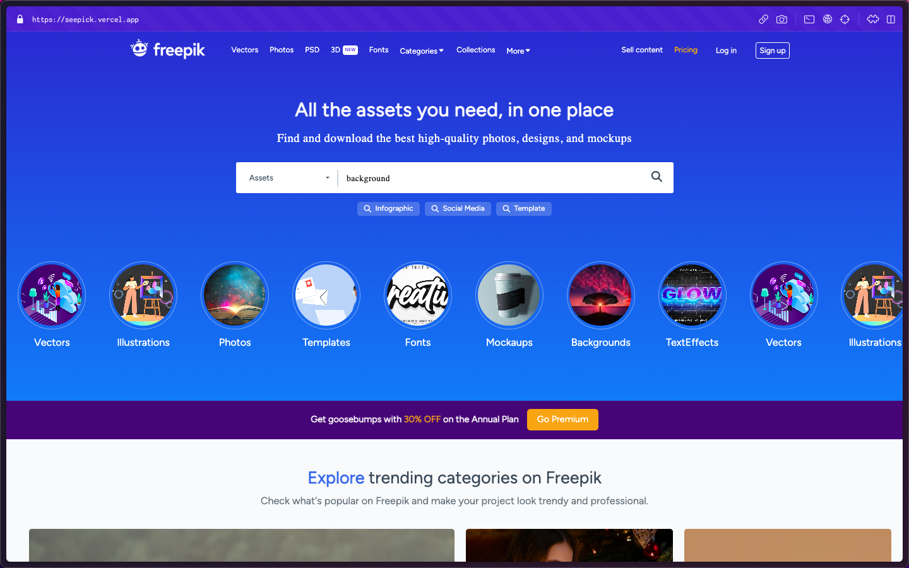
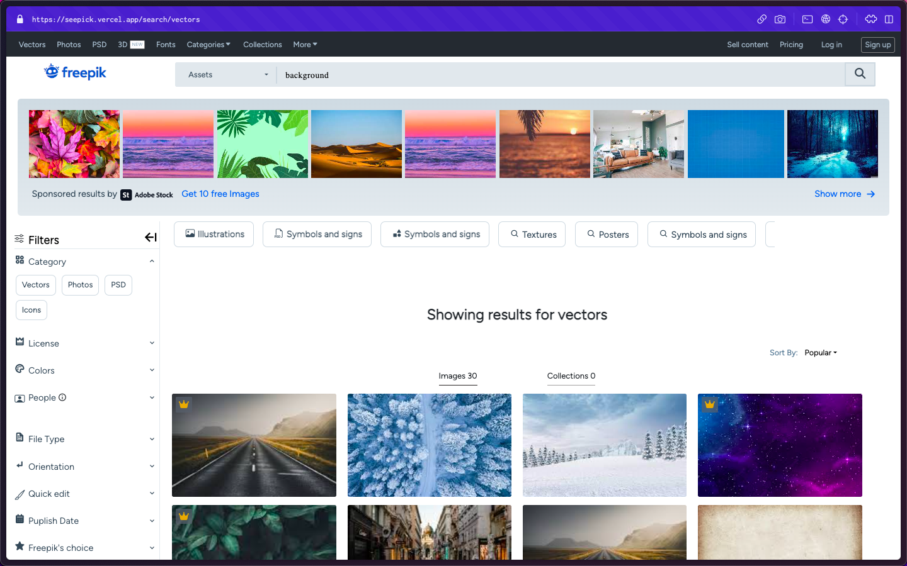
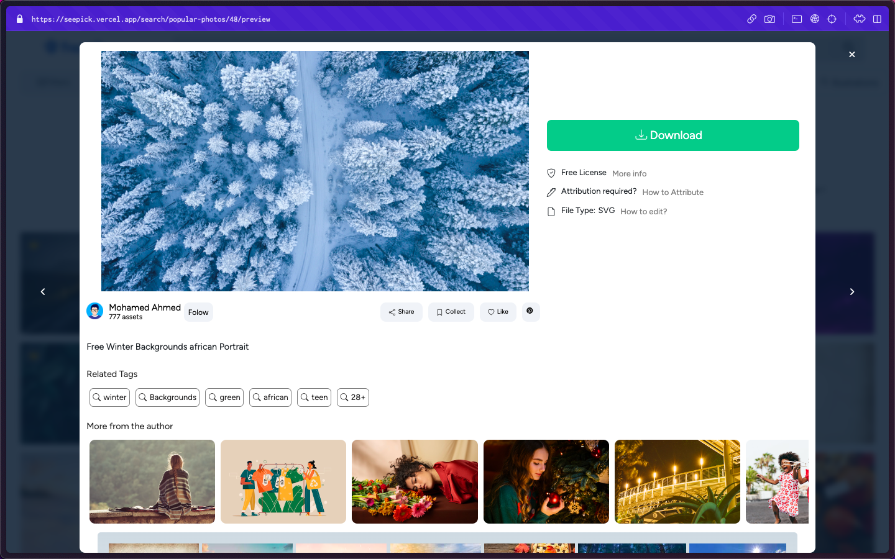
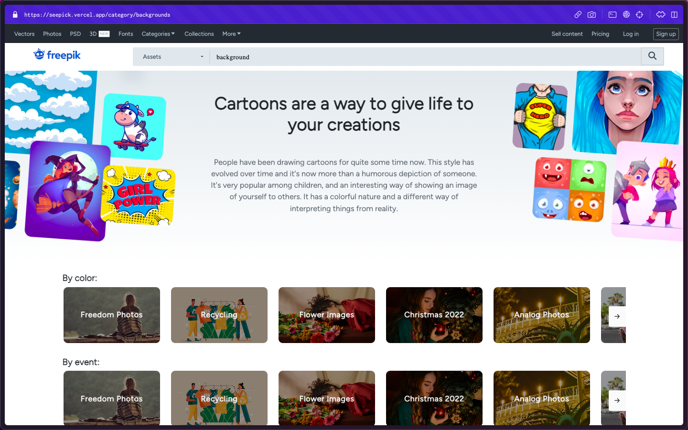
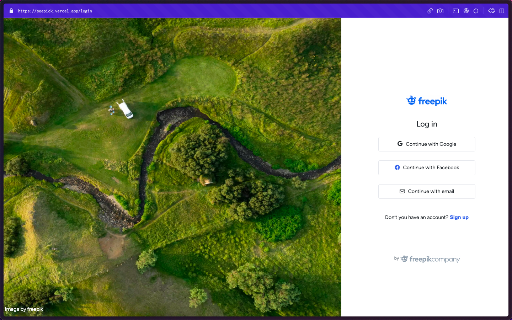
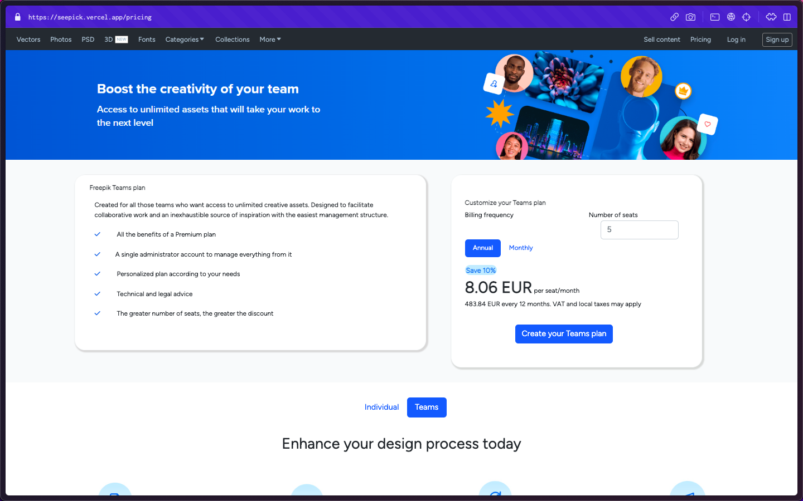
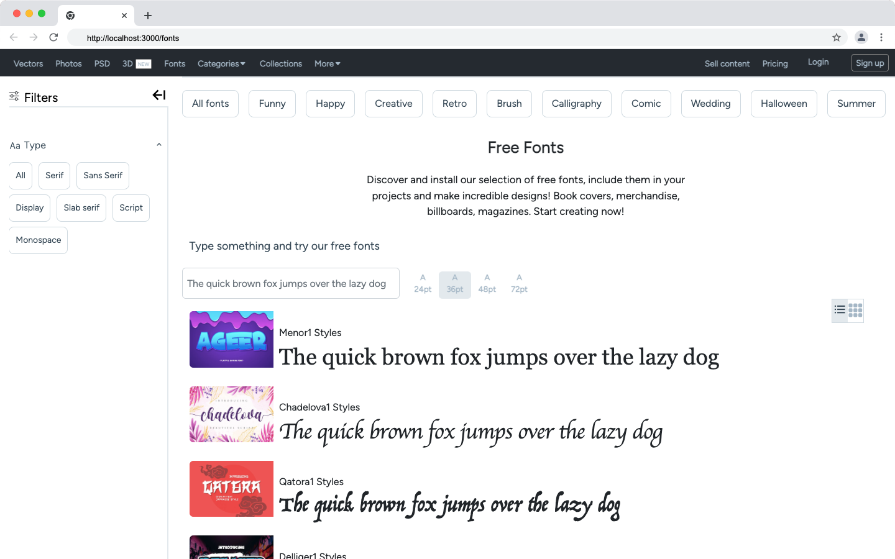
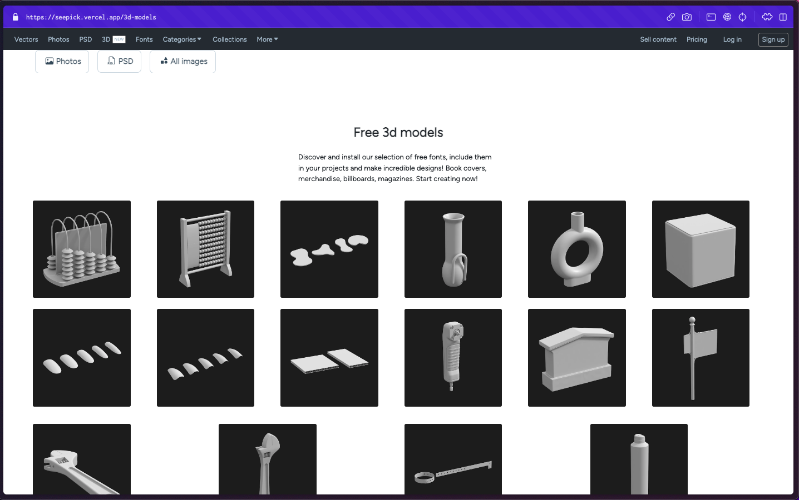
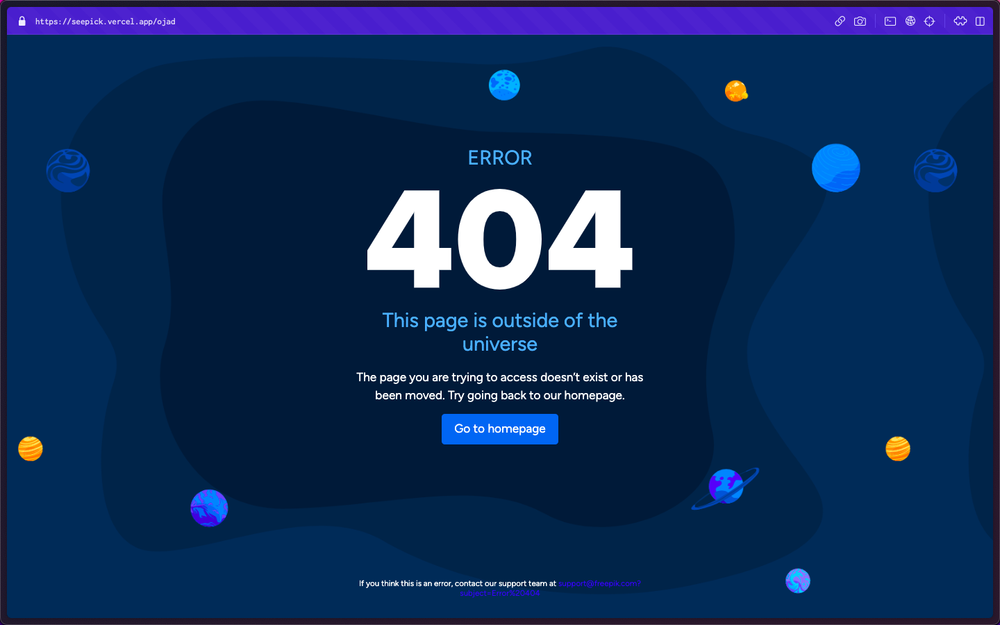

## Refactoring in progress!!!

<p align="center">
    
</p>
<h1 align="center">
  Seepik - A Freepik Clone
</h1>

<p align="center">
    
 
</p>

<p align="center">

</p>
<p align="center">
    <a href="https://seepick.vercel.app" target="blank">View Demo</a>
    ·
    <a href="https://github.com/Yousef-Salah/freepik-cap/issues/new">Report Bug</a>
    ·
    <a href="https://github.com/Yousef-Salah/freepik-cap/issues/new">Request Feature</a>
</p>

#### Welcome to Our Freepik Clone!

Freepik offers graphic resources for designers and creatives, including free and paid options through a subscription-based model. It's a leading website with millions of users worldwide and additional services like Flaticon and Slidesgo for icons and presentation templates.

We as school students, we've worked on cloning it through a project, and now willing to maintain it and make it open for the community. Currently the project is maintained By 2 Contributors @OmarMHawash and @Yousef-Salah . The last succesful version of the website is deployed in the [demo](https://seepick.vercel.app) site. We are currently focused on refactoring the code base, more than adding features/fixing bugs, then we will be adding more features to the website.

<h2 id="demo"> 🚀 Demo </h2>


Checkout The Demo: [Live Demo](https://seepick.vercel.app)

<h2 id="markdown-navigation"> 🧭 Markdown Navigation </h2>

- [Quick Start](#quick-start)
- [Features](#features)
- [Resources](#resources)
- [Preview](#preview)
- [What's New?](#changes)

<h2 id="quick-start">🛠️ Installation Steps </h2>

### \*pre-requisites

you will need to have **Node.js** installed on your computer and **Git** (or you can download as a **zip file**). we are using the **npm** package manager, yarn and pnpm would work perfectly.

## Steps

1. Clone the repository

```bash
git clone https://github.com/Yousef-Salah/freepik-cap.git
```

2. Change the working directory

```bash
cd freepik-cap
```

3. Install dependencies and run the app

```bash
npm install && npm start
```

<h2 id="features">🤯 Features & Functionalities </h2>

#### Features:

- 8+ Pages with Fully responsive layout.
- 34+ Different components.
- Used Packages: Sass, Bootstrap 5.
- Used Features: JSX, Hooks, ContextAPI
- Website Images data is scraped from the internet Selenium driver (for testing only).

#### Functionalities

- Image searching throughout single search component.
- Implemented SPA for the search page.

(in progress) refactoring the code & file structure

<h2 id="resources">💻 Technologies Used </h2>

#### [Project Documentation](https://github.com/Yousef-Salah/freepik-cap/docs/documentation.md)

- This project was bootstrapped with [Create React App](https://github.com/facebook/create-react-app).
- Used [Bootstrap](https://getbootstrap.com/) to maintain a general resposive layout, with [SASS](https://sass-lang.com/) for better stylesheets management.

<h2 id="preview">🌁 Project showdown</h2>

### Home Page


</p>

### Searching Images



### Preview Modal



### Categories Browsing



### registration



### Premuim Pricing



### Fonts Search



### 3D models Search



### Error Handleling



<h2 id="changes"> 🆕 What's New </h2>

### Latest Features

- ...

### Changelog

- ...
- ...

<h2 id="contribute"> ➕ Contributing to the project </h2>

- [Issue Template](https://github.com/Yousef-Salah/freepik-cap/docs/new_issue.md)
- [Contribute Guidelines](https://github.com/Yousef-Salah/freepik-cap/docs/guidelines.md)
- [Upcoming Changes](https://github.com/Yousef-Salah/freepik-cap/docs/upcoming.md)

`npx eslint --fix {file_name}.{ext}`
